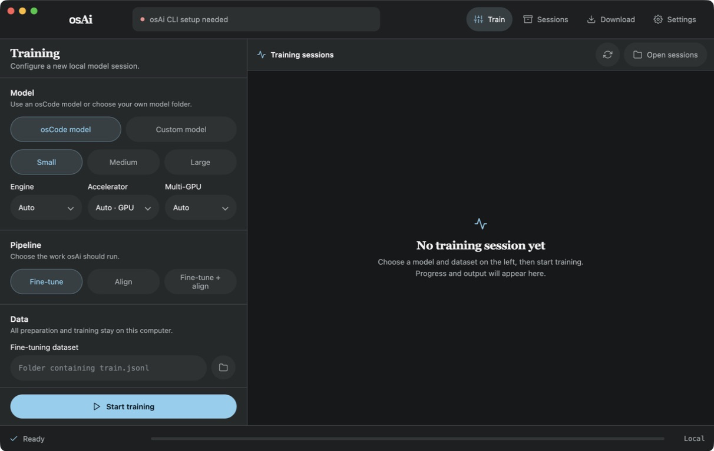
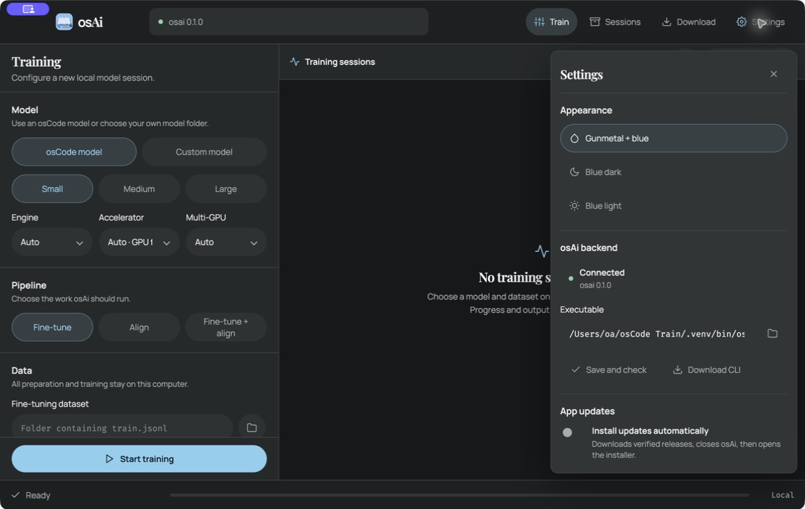

<p align="center">
  
</p>


<p align="center">
  <a href="assets/screenshots/0001.png">
    
  </a>
</p>

<p align="center">
  <a href="assets/screenshots/0002.png">
    
  </a>
</p>

**osAi App** is the desktop interface for [osAi CLI](https://github.com/OmerDesignX/osAi-CLI). It trains LoRA adapters for quantized MLX and GGUF language models while keeping the quantized base frozen.

Training, inference, rollout generation, alignment, logs, adapters, and final models remain local after any selected model download completes. There is no telemetry.

osCode Models are supported by default, and custom models can be added. See [osCode Models](https://github.com/OmerDesignX/osCode-Models).

Supported training modes:

- MLX gradient LoRA on Apple silicon and Linux.
- llama.cpp gradient LoRA on GGUF models.
- DPO, IPO, SimPO, ORPO, CPO, KTO, PPO, REINFORCE, RLOO, and GRPO alignment.

Both engines use reverse-mode gradients and update only LoRA adapter tensors. **Auto** uses AdamW for MLX and SGD for llama.cpp. The quantized base is never dequantized or requantized during training or publication.

## Hardware support

| System                                    | Engines                                                          |
| ----------------------------------------- | ---------------------------------------------------------------- |
| macOS 12 Monterey or 13 Ventura           | llama.cpp on Metal or CPU                                        |
| macOS 14 Sonoma or newer on Apple silicon | MLX and llama.cpp on Metal or CPU                                |
| Windows 10 or 11                          | llama.cpp on CUDA, Vulkan, or CPU                                |
| Debian 12 / Ubuntu 22.04 or newer         | MLX and llama.cpp on CUDA or CPU; llama.cpp also supports Vulkan |

Every completed run publishes both `base-plus-adapter` and a standalone lossless deployment bundle. The base remains quantized and byte-for-byte unchanged, with the exact adapter residual stored beside it.

## Install

1. Download the installer for your computer from the [osAi releases](https://github.com/OmerDesignX/osAi-CLI/releases), then open osAi App.
2. On first launch, press **Download to start** and install the osAi CLI using its hardware-aware setup.
3. The training workspace opens automatically when the CLI is detected. It supports Python 3.10, 3.11, 3.12, and 3.13 and builds MLX and llama.cpp for the current computer.
4. If an existing installation is not found automatically, open **Settings**, select its executable under **osAi backend**, then press **Save and check**.

The backend setup detects the operating system, architecture, macOS version, CUDA toolkit, and Vulkan tools. It selects GPU acceleration first and falls back to CPU when an automatically selected llama.cpp GPU build is unavailable.

## Start a training session

1. Under **Model**, press **osCode model** or **Custom model**.
2. For an osCode model, press **Small**, **Medium**, or **Large**. For a custom model, press the folder button and select its model folder.
3. Leave **Engine**, **Accelerator**, and **Multi-GPU** on **Auto** for hardware-aware selection, or choose them manually.
4. Under **Pipeline**, press **Fine-tune**, **Align**, or **Fine-tune + align**.
5. Press the dataset browse button and select either a `.json`/`.jsonl` file or a folder containing `train.jsonl`.
6. Keep **Fit settings to this hardware** enabled unless manual control is needed.
7. Enter a recognizable **Session name**, or leave the suggested name in place.
8. Choose **Save sessions in** when a different location is needed. The default is `~/osAi/sessions` in the user's home folder.
9. Press **Start training**.

While a run is active, **Start training** becomes **Pause training** and **Stop training**. A paused run can be resumed from the same controls. An official model is downloaded and verified only when the selected MLX or GGUF variant is not already present. The active session displays its phase, progress, and live output. Its complete configuration is restored when the app reopens or that session is selected again.

Choose a single `.json` or `.jsonl` dataset file, or a folder containing `train.jsonl` with optional `valid.jsonl` and `test.jsonl` splits. Fine-tuning rows may use `text`, `prompt` with `completion`, or a `messages` list.

### Pipeline buttons

| Button                | What it does                                                              | Required selections                            |
| --------------------- | ------------------------------------------------------------------------- | ---------------------------------------------- |
| **Fine-tune**         | Trains a new LoRA adapter                                                 | Model and fine-tuning dataset                  |
| **Align**             | Aligns an existing adapter                                                | Model, alignment dataset, and existing adapter |
| **Fine-tune + align** | Fine-tunes first and passes the resulting adapter directly into alignment | Model and training data                        |

With **Fine-tune + align**, leave **Use the fine-tuning dataset for alignment** enabled to use one dataset for both stages. Turn it off to choose a separate alignment dataset.

## Alignment

Select **Align** or **Fine-tune + align** to reveal the alignment controls.

- Use **Method → Auto** to select DPO for preference pairs and PPO for reward rows.
- Select a named method when a specific objective is required. Choose **ORPO** directly from this menu when desired.
- Leave **Optimizer → Auto** to use AdamW with MLX and SGD with llama.cpp.
- Leave **Generate fresh answers locally** enabled to make the current fine-tuned policy generate and score new answers during the run.
- Turn **Generate fresh answers locally** off only when the alignment dataset already contains the responses or scores to train from.

Alignment rows contain either `prompt`, `chosen`, and `rejected`, or `prompt`, `response`, and a numeric `reward` with optional `old_logprob`.

Fresh answers are generated by the local fine-tuned model. Pairwise methods compare them with local references, while reward methods use local reference-derived scoring. RLOO and GRPO generate at least two answers per prompt and calculate their group baselines locally. “Live” or “online” RL means the current policy creates fresh experience during the run; it does not mean an internet connection or hosted service.

### Alignment method guide

| Method    | Data style                      | What it optimizes                                           | Use it when                                             | Main trade-off                               |
| --------- | ------------------------------- | ----------------------------------------------------------- | ------------------------------------------------------- | -------------------------------------------- |
| DPO       | Pairwise preferences            | Reference-relative chosen/rejected margin                   | A dependable pairwise default is wanted                 | Keeps a frozen reference and depends on beta |
| IPO       | Pairwise preferences            | A finite squared preference-margin target                   | DPO over-separates noisy preference pairs               | Target and beta need care                    |
| SimPO     | Pairwise preferences            | Reference-free, length-normalized margin                    | Memory is tight or no reference term is wanted          | Margin gamma needs tuning                    |
| ORPO      | Pairwise preferences            | Chosen likelihood plus odds-ratio preference loss           | Chosen-answer quality should remain explicit            | Can overfit very small datasets              |
| CPO       | Pairwise preferences            | Contrastive margin plus chosen likelihood                   | A compact objective without a reference model is wanted | Sensitive to chosen-data quality             |
| KTO       | Binary feedback                 | Desirable responses up and undesirable responses down       | Feedback is thumbs-up/down rather than paired           | Label balance and beta matter                |
| PPO       | Preference or reward references | Clipped policy-ratio updates over fresh answers             | Conservative policy updates are wanted                  | Sensitive to reward quality and clipping     |
| REINFORCE | Preference or reward references | Reward-weighted answer log-probability                      | The simplest low-memory policy gradient is wanted       | Higher gradient variance                     |
| RLOO      | Preference or reward references | REINFORCE with a leave-one-out baseline                     | Multiple answers per prompt can reduce variance         | Requires at least two answers per prompt     |
| GRPO      | Preference or reward references | Group-standardized clipped updates with a reference penalty | Several answers and no learned critic are wanted        | Requires reward variation inside each group  |

```text
                                      LLM ALIGNMENT / POST-TRAINING
                                                    |
                                  LOCAL EXECUTION -- NO SERVERS
                                                    |
                                      FINE-TUNED CURRENT POLICY
                                                    |
                         +--------------------------+--------------------------+
                         |                                                     |
              FRESH ANSWERS (DEFAULT)                              EXISTING RESPONSES
                         |                                                     |
               Generate local answers                              Turn off "Generate
               for each local prompt                               fresh answers locally"
                         |                                                     |
                 Score or pair answers                              Use supplied pairs or
                using local references                              pre-scored response rows
                         |
              +----------+-----------------------------------------+
              |                    |                               |
       PAIRWISE PREFERENCES   BINARY FEEDBACK                POLICY GRADIENT
              |                    |                               |
             DPO                  KTO                         REINFORCE
             IPO                                                 RLOO
            SimPO                                                GRPO
             ORPO                                                 PPO
             CPO
```

No rollout, critic, reward-model, telemetry, or internet server is started. PPO uses its clipped policy surrogate without a learned critic model.

## Automatic hardware settings and multi-GPU

**Fit settings to this hardware** is enabled by default. It reserves memory for the operating system and runtime, checks that the selected base model fits, and chooses the largest conservative training profile that is safe for the available RAM.

Use **Advanced** to set:

- **Optimization:** iterations, optimizer, batch size, gradient accumulation, sequence length, learning rates, and seed
- **LoRA adapter:** rank, scale, adapted layers, dropout, and target projections
- **Alignment and rollouts:** beta, gamma, PPO clipping, answers per prompt, maximum new tokens, temperature, top-p, and seed
- **Saving and evaluation:** checkpoint cadence, gradient checkpointing, reporting, validation, and prompt masking
- **Engine runtime:** GGUF microbatch and threads, MLX workers, GPU split, main GPU, and device order

Turn on **Name this session** above **Advanced** to replace the automatic model-and-pipeline session name.

The **Multi-GPU** selector provides:

| Selection   | Behaviour                                                      |
| ----------- | -------------------------------------------------------------- |
| **Auto**    | Uses the compatible devices reported by Metal, CUDA, or Vulkan |
| **Require** | Requires more than one compatible GPU and stops if unavailable |
| **Off**     | Uses one selected GPU or CPU fallback                          |

llama.cpp distributes work across compatible Metal, CUDA, or Vulkan devices. MLX uses local NCCL data parallelism on multi-GPU Linux CUDA systems. Apple silicon normally exposes one unified Metal GPU; systems exposing multiple Metal devices can use the devices reported by the backend.

## Custom models

Organize each custom model inside its own folder:

```text
models/custom/my-model/
├── mlx/       # MLX model files
└── gguf/      # one GGUF file or a complete split set
```

In the App, press **Custom model**, press the **Model folder** button, and select `my-model`. Leave **Engine → Auto** to choose the compatible format automatically.

## Sessions and output

Each run receives its own local date-and-time folder. The session view shows progress, the current phase, and live backend output.

- Press a session tab to inspect that run.
- Press **Stop** to request a clean stop after the current backend operation.
- Press **Show files** to reveal the selected session.
- Press **Open sessions** or the top-bar **Sessions** button to open the complete sessions folder.
- Closing the App does not stop training. The detached local worker continues until completion or until **Stop** is pressed.

A completed run contains the same organized output as osAi CLI:

```text
session/
├── manifests/
├── logs/
├── outputs/base-plus-adapter/
└── outputs/merged-model/
```

Combined runs keep the supervised stage below `stages/fine-tuning/` and place the final aligned adapter and deployment bundle in the parent session’s `outputs/` directory.

For MLX, the deployment bundle leaves every quantized tensor unchanged and embeds the adapter in `osai_adapter/`. osAi verifies that its next-token logits exactly match the original base-plus-adapter path.

For GGUF, the bundle keeps the original file or split shards unchanged under `model/`, stores the exact adapter as `osai_adapter.gguf`, and records both in `osai_fusion.json`. SHA-256 checks verify the copied base and adapter. No unified, dequantized, or requantized model is created.

## App controls

| Control                                   | Purpose                                                                     |
| ----------------------------------------- | --------------------------------------------------------------------------- |
| **Train**                                 | Return to the training workspace                                            |
| **Sessions**                              | Open the local sessions directory                                           |
| **Download / Ready / Update / Install**   | Check for an App update, download it, then open its native installer        |
| **Settings**                              | Configure appearance, backend connection, and App updates                   |
| **osCode model / Custom model**           | Choose the model source                                                     |
| **Small / Medium / Large**                | Choose an official osCode model tier                                        |
| **Engine**                                | Select Auto, MLX, or llama.cpp                                              |
| **Accelerator**                           | Select GPU-first Auto, Metal, MPS, CUDA, Vulkan, or CPU                     |
| **Multi-GPU**                             | Automatically use devices, require multiple GPUs, or use one device         |
| **Fine-tune / Align / Fine-tune + align** | Choose the training pipeline                                                |
| **Method**                                | Select Auto, DPO, IPO, SimPO, ORPO, CPO, KTO, PPO, REINFORCE, RLOO, or GRPO |
| **Optimizer**                             | Select Auto, SGD, or AdamW                                                  |
| **Generate fresh answers locally**        | Enable local live rollout generation for alignment                          |
| **Fit settings to this hardware**         | Apply RAM-aware engine and training settings                                |
| **Name this session**                     | Replace the automatic run name                                              |
| **Advanced**                              | Reveal optimization, LoRA, rollout, evaluation, and runtime controls        |
| **Start training**                        | Validate the selections and start a detached local run                      |
| **Stop**                                  | Stop the selected active run cleanly                                        |
| **Show files / Open sessions**            | Open local output folders                                                   |

## Settings

Press **Settings** to choose **Gunmetal + blue**, **Blue dark**, or **Blue light**; connect the osAi backend; or manage App updates.

The top-bar download button says **Download** before its first manual check, **Ready** when the installed App is current, **Update** when a newer native package is available, and **Install** after its SHA-256-verified download finishes. Press **Install** to close osAi and open the DMG, EXE, or DEB. Enable **Install updates automatically** to perform that handoff automatically after a verified download. The separate **Download CLI** button remains under **osAi backend**.

Network access is limited to optional App updates and official model downloads; training data and model outputs are never sent to those services.

## Build release installers

Maintainers can edit `releaseScripts/VERSION.txt` and run the native build script:

```sh
# macOS 12 or newer: Apple Silicon and Intel DMGs
bash releaseScripts/macos/build.sh

# Windows 10 or 11
.\releaseScripts\windows\build-windows.cmd

# Debian or Ubuntu
bash releaseScripts/linux/build.sh
```

Verified unsigned installers are written to `release-assets/macos`, `release-assets/windows`, or `release-assets/linux`. See [releaseScripts/README.md](releaseScripts/README.md) for their filenames.

## License

osAi is Apache-2.0 licensed. The osAi backend, vendored projects, and downloaded models retain their own licenses.
