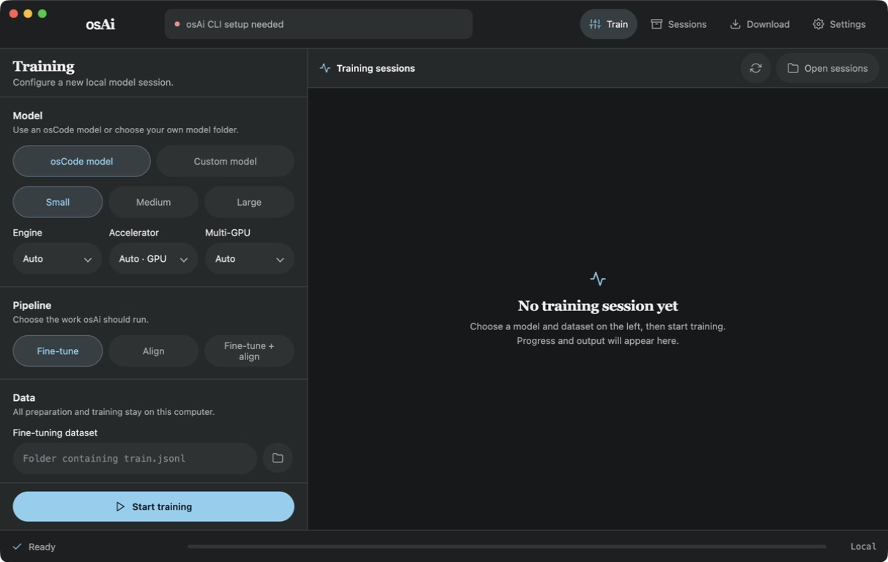
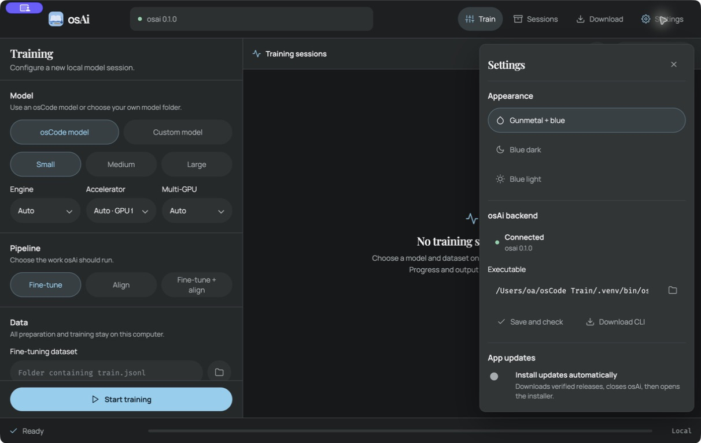

<p align="center">
  
</p>


<p align="center">
  <a href="assets/screenshots/0001.png">
    
  </a>
</p>

<p align="center">
  <a href="assets/screenshots/0002.png">
    
  </a>
</p>

**osAi App** is the desktop interface for [osAi CLI](https://github.com/OmerDesignX/osAi-CLI). It trains LoRA adapters for quantized MLX and GGUF language models while keeping the quantized base frozen.

Training, inference, rollout generation, alignment, logs, adapters, and final models remain local after any selected model download completes. There is no telemetry.

osCode Models V1 and V2 are supported by default, and custom models can be added. See [osCode Models](https://models.omerdesign.com/oscode-models/).

Supported training modes:

- MLX gradient LoRA on Apple silicon and Linux.
- Quantized MLX-VLM gradient LoRA using local images, video, and compatible
  audio.
- llama.cpp gradient LoRA on GGUF models.
- DPO, IPO, SimPO, ORPO, CPO, KTO, PPO, REINFORCE, RLOO, and GRPO alignment.

Both engines use reverse-mode gradients and update only LoRA adapter tensors. **Auto** uses AdamW for MLX and SGD for llama.cpp. The quantized base is never dequantized or requantized during training or publication.

For hybrid GGUF architectures, osAi selects each LoRA projection from the
blocks where that tensor actually exists instead of assuming every block has
attention weights. Long supervised records use overlapping context windows
that preserve every answer label; plain-text corpora remain fully trainable.

## Hardware support

| System                                    | Engines                                                          |
| ----------------------------------------- | ---------------------------------------------------------------- |
| macOS 12 Monterey or 13 Ventura           | llama.cpp on Metal or CPU                                        |
| macOS 14 Sonoma or newer on Apple silicon | MLX and llama.cpp on Metal or CPU                                |
| Windows 10 or 11                          | llama.cpp on CUDA, Vulkan, or CPU                                |
| Debian 12 / Ubuntu 22.04 or newer         | MLX and llama.cpp on CUDA or CPU; llama.cpp also supports Vulkan |

Every completed run publishes both `base-plus-adapter` and a standalone lossless deployment bundle. The base remains quantized and byte-for-byte unchanged, with the exact adapter residual stored beside it.

## Install

1. Download the installer for your computer from the [osAi releases](https://github.com/OmerDesignX/osAi/releases), then open osAi App.
2. On first launch, setup starts automatically. The App downloads the osAi CLI source, installs its Python packages using the included CPython 3.12 runtime, and compiles llama.cpp on this computer. Internet access is required for this first setup. The setup screen offers a retry button if a download or build fails.
3. The training workspace opens when setup and the native build finish. The setup screen shows download and compiler progress. Each package includes CMake and Ninja for its platform. Windows setup detects Microsoft C++ Build Tools or downloads a verified portable C++ toolchain. macOS and Linux need their native C/C++ tools for local compilation.
4. If an existing installation is not found automatically, open **Settings**, select its executable under **osAi backend**, then press **Save and check**.

The native llama.cpp build selects Metal on macOS, CUDA and Vulkan when their SDKs are present on Windows or Linux, and CPU when no GPU toolchain is available. An attempted GPU build that fails is reported during setup. Windows setup can download a verified Vulkan SDK into its private build cache if the runtime is present but the SDK is missing. Apple silicon with macOS 14 or newer can also use MLX.

## Start a training session

1. Under **Model**, press **osCode model** or **Custom model**.
2. For an osCode model, select **V2** (default) or **V1**, then choose its size. V2 also includes **xSmall**. For a custom model, press the folder button and select its model folder.
3. Leave **Engine**, **Accelerator**, and **Multi-GPU** on **Auto** for hardware-aware selection, or choose them manually.
4. Under **Pipeline**, press **Fine-tune**, **Align**, or **Fine-tune + align**.
5. Press the dataset browse button and select a `.json`, `.jsonl`, `.ndjson`, or `.parquet` file, or a folder containing data files.
6. Keep **Fit settings to this hardware** enabled and press **Calibrate**. In the default **Full** context mode, osAi first scans every selected training file for its longest tokenized record and checks the model's context limit. The exact scan can take several minutes on a large dataset. It then fits the hardware and runs a small pilot on short excerpts. The pilot finishes its sample even when model loading takes longer than expected. **Quick Settings** unlocks when the pilot loss decreases. The selected data is not changed.
7. Enter a recognizable **Session name**, or leave the suggested name in place.
8. Choose **Save sessions in** when a different location is needed. The default is `~/osAi/sessions` in the user's home folder.
9. Press **Start training** after calibration completes. Changing the model, dataset, optimizer, epoch count, context mode, or GPUs requires calibration again.

The bottom bar is the single progress display for setup, hardware fitting,
calibration, training, and app updates. It shows the current step; stages without
a reliable total use a moving indicator. Open **Hardware** in the top strip to
see the CPU and each detected GPU. NVIDIA and available AMD SMI drivers provide
live GPU memory, load, and temperature. Vulkan and Metal still list GPUs when
their drivers do not expose these sensors. Apple silicon uses shared system
memory, so total host memory is not presented as GPU memory usage.

While a run is active, **Start training** becomes **Pause training**, **Save checkpoint**, and **Stop training**. A paused run can be resumed from the same controls. **Save checkpoint** writes the current adapter at the next safe optimizer step; a paused run finishes its save after resuming. The session shows when the latest adapter and reusable model are ready. Automatic saves replace the same latest checkpoint rather than collecting numbered copies. An official model is downloaded and verified only when the selected MLX or GGUF variant is not already present. Individual split shards, MLX files, and V2 GGUF projectors are downloaded from the selected V1/V2 catalog and checked against its published SHA-256 list. The active session displays its phase, progress, and live output. Its complete configuration is restored when the app reopens or that session is selected again.

On the first launch after upgrading, complete V1 downloads in `~/osAi/models/MLX` or `~/osAi/models/GGUF` are made available under `~/osAi/models/V1` using same-volume hard links. This does not download or store another copy of the model, and the original paths remain valid for older sessions. The app never overwrites an existing V1 folder, leaves incomplete downloads untouched, and waits until active training has stopped before doing this. A legacy model remains usable if promotion is unavailable on its filesystem.

Choose a single `.json`, `.jsonl`, `.ndjson`, or `.parquet` file, or a folder containing several such files. All supported files in the folder and its subfolders are included. Filenames beginning with `valid`, `validation`, or `dev` become validation data, and filenames beginning with `test` become test data. Other data files train. Parquet is converted into session-local JSONL before training; the originals are left alone. JSON arrays and objects containing `train`, `data`, `records`, `examples`, or `items` arrays are unpacked automatically.

| Dataset layout                  | Accepted fields                                                                                |
| ------------------------------- | ---------------------------------------------------------------------------------------------- |
| Language modelling              | `text`                                                                                         |
| Completion                      | string or conversational `prompt` + `completion`                                               |
| Chat and tools                  | OpenAI `messages`, content parts, `tools`, and `tool_calls`                                    |
| ShareGPT and dialogue           | `conversations`, `conversation`, `dialog`, `dialogue`, `chat`, or `turns`                      |
| Instruction                     | Alpaca `instruction/input/output` and Dolly `instruction/context/response`                     |
| QA and translation              | SQuAD answers, `question/answer`, translation dictionaries, and source/target pairs            |
| Common task pairs               | Problem/solution, request/response, document/summary, article/highlights, and description/code |
| Preference used for fine-tuning | `prompt` + `chosen/rejected`; the chosen answer becomes the target                             |

Equivalent supervised layouts may be mixed in one split. osAi checks every row
and converts it to one canonical local dataset. Image, audio, video, and
multimodal content-part layouts are passed to a complete local quantized MLX VLM.
Relative paths resolve beside the selected dataset file. The CLI stages data
inside the session when needed and resolves local media references. It never
fetches a media URL from a dataset.

Press **Data editor** above the session tabs, or **Inspect or repair training
data** in the Data section, to scan a complete dataset before training. It
shows recognized and invalid rows, inferred fields, duplicate counts,
modalities, and a token-limit recommendation. Unfamiliar columns can be mapped
to prompts, answers, conversations, preferences, rewards, or raw text. You can
repair previewed JSON rows, create validation and test splits, and save a clean
canonical copy without changing the source data. Selecting **Use for
fine-tuning** or **Use for alignment** returns that copy to the training form;
hardware fitting uses the model and available hardware; the dataset's row count
and token-limit recommendation do not change the Auto training profile.

The **Context** control defaults to **Full**. Full scans all selected training
files before calibration and requests enough context for the largest record.
The GGUF model tokenizer determines its exact token count. If that context
exceeds the model limit or cannot fit device memory, calibration reports the
limit instead of silently changing modes. Select **Windowing** to train long
records as overlapping windows; every supervised answer token remains covered.
Assistant-supervised GGUF training stores each record at its actual token length
and pads only the active batch. It stops work after the record's last supervised
token. The longest record still sets the native context and must fit on the
selected GPU.

Choose a complete VLM under **Custom model** for media training. For a GGUF VLM,
the same custom model folder must also contain its matching quantized MLX VLM;
the media-conditioned backward pass runs in MLX and osAi exports the language
adapter to GGUF. Any `mmproj*.gguf` sidecar is retained unchanged. The current
model's processor and actual media-tower tensors are checked before training.

### Pipeline buttons

| Button                | What it does                                                              | Required selections                            |
| --------------------- | ------------------------------------------------------------------------- | ---------------------------------------------- |
| **Fine-tune**         | Trains a new LoRA adapter                                                 | Model and fine-tuning dataset                  |
| **Align**             | Aligns an existing adapter                                                | Model, alignment dataset, and existing adapter |
| **Fine-tune + align** | Fine-tunes first and passes the resulting adapter directly into alignment | Model and training data                        |

With **Fine-tune + align**, leave **Use the fine-tuning dataset for alignment** enabled to use one dataset for both stages. Turn it off to choose a separate alignment dataset.

## Alignment

Select **Align** or **Fine-tune + align** to reveal the alignment controls.

- Use **Method → Auto** to select DPO for preference pairs and PPO for reward rows.
- Select a named method when a specific objective is required. Choose **ORPO** directly from this menu when desired.
- Leave **Optimizer → Auto** to use AdamW with MLX and SGD with llama.cpp.
- Leave **Generate fresh answers locally** enabled to make the current fine-tuned policy generate and score new answers during the run.
- Turn **Generate fresh answers locally** off only when the alignment dataset already contains the responses or scores to train from.

Alignment accepts standard or conversational `prompt/chosen/rejected`, implicit
chosen/rejected conversations with a shared prompt, common
`preferred/non_preferred` or `winner/loser` aliases, ranked
`response_j/response_k`, numeric `prompt/response/reward`, and KTO
`prompt/completion/label` rows.

Fresh answers are generated by the local fine-tuned model. Pairwise methods compare them with local references, while reward methods use local reference-derived scoring. RLOO and GRPO generate at least two answers per prompt and calculate their group baselines locally. “Live” or “online” RL means the current policy creates fresh experience during the run; it does not mean an internet connection or hosted service.

### Alignment method guide

| Method    | Data style                      | What it optimizes                                           | Use it when                                             | Main trade-off                               |
| --------- | ------------------------------- | ----------------------------------------------------------- | ------------------------------------------------------- | -------------------------------------------- |
| DPO       | Pairwise preferences            | Reference-relative chosen/rejected margin                   | A dependable pairwise default is wanted                 | Keeps a frozen reference and depends on beta |
| IPO       | Pairwise preferences            | A finite squared preference-margin target                   | DPO over-separates noisy preference pairs               | Target and beta need care                    |
| SimPO     | Pairwise preferences            | Reference-free, length-normalized margin                    | Memory is tight or no reference term is wanted          | Margin gamma needs tuning                    |
| ORPO      | Pairwise preferences            | Chosen likelihood plus odds-ratio preference loss           | Chosen-answer quality should remain explicit            | Can overfit very small datasets              |
| CPO       | Pairwise preferences            | Contrastive margin plus chosen likelihood                   | A compact objective without a reference model is wanted | Sensitive to chosen-data quality             |
| KTO       | Binary feedback                 | Desirable responses up and undesirable responses down       | Feedback is thumbs-up/down rather than paired           | Label balance and beta matter                |
| PPO       | Preference or reward references | Clipped policy-ratio updates over fresh answers             | Conservative policy updates are wanted                  | Sensitive to reward quality and clipping     |
| REINFORCE | Preference or reward references | Reward-weighted answer log-probability                      | The simplest low-memory policy gradient is wanted       | Higher gradient variance                     |
| RLOO      | Preference or reward references | REINFORCE with a leave-one-out baseline                     | Multiple answers per prompt can reduce variance         | Requires at least two answers per prompt     |
| GRPO      | Preference or reward references | Group-standardized clipped updates with a reference penalty | Several answers and no learned critic are wanted        | Requires reward variation inside each group  |

```text
                                      LLM ALIGNMENT / POST-TRAINING
                                                    |
                                  LOCAL EXECUTION -- NO SERVERS
                                                    |
                                      FINE-TUNED CURRENT POLICY
                                                    |
                         +--------------------------+--------------------------+
                         |                                                     |
              FRESH ANSWERS (DEFAULT)                              EXISTING RESPONSES
                         |                                                     |
               Generate local answers                              Turn off "Generate
               for each local prompt                               fresh answers locally"
                         |                                                     |
                 Score or pair answers                              Use supplied pairs or
                using local references                              pre-scored response rows
                         |
              +----------+-----------------------------------------+
              |                    |                               |
       PAIRWISE PREFERENCES   BINARY FEEDBACK                POLICY GRADIENT
              |                    |                               |
             DPO                  KTO                         REINFORCE
             IPO                                                 RLOO
            SimPO                                                GRPO
             ORPO                                                 PPO
             CPO
```

No rollout, critic, reward-model, telemetry, or internet server is started. PPO uses its clipped policy surrogate without a learned critic model.

## Automatic hardware settings and multi-GPU

**Fit settings to this hardware** is enabled by default. After CLI setup, osAi runs a local one-turn inference benchmark with the selected model across the selected GPUs. It tries the largest profile allowed by host and reported GPU memory, keeping room for backward graphs and the operating system. Changing the model, accelerator, GPU settings, or attached devices reruns the benchmark and shows a notification. The dataset size does not affect the memory profile. Press **Calibrate** after selecting the dataset. A short training pilot then measures whether a cautious learning rate reduces loss on sampled records. Training stays locked until that pilot succeeds. A short pilot cannot guarantee decreasing loss throughout a long, varied dataset; **Auto stop** watches for sustained increases during the full run.

Use **Advanced** to set:

- **Optimization:** dataset epochs, optimizer, batch size, gradient accumulation, sequence length, learning rates, and seed
- **LoRA adapter:** rank, scale, adapted layers, dropout, and target projections
- **Media:** optional image size, video frame rate and frame cap, and assistant token ID
- **Alignment and rollouts:** beta, gamma, PPO clipping, answers per prompt, maximum new tokens, temperature, top-p, and seed
- **Saving and evaluation:** checkpoint cadence, gradient checkpointing, reporting, validation, and prompt masking
- **Engine runtime:** GGUF microbatch and threads, MLX workers, GPU split, main GPU, and device order

Turn on **Name this session** above **Advanced** to replace the automatic model-and-pipeline session name.

The **Multi-GPU** selector provides:

| Selection   | Behaviour                                                      |
| ----------- | -------------------------------------------------------------- |
| **Auto**    | Uses the compatible devices reported by Metal, CUDA, or Vulkan |
| **Require** | Requires more than one compatible GPU and stops if unavailable |
| **Off**     | Uses one selected GPU or CPU on a CPU-only computer            |

For GGUF fine-tuning and alignment, osAi loads one model across the selected GPUs by layer. A single native trainer performs each optimizer step and saves one adapter at the selected rank. GPU memory is used across the cards, although the largest layer, activations, and device-specific overhead still need to fit on their assigned card. A 3 GiB card can participate when its assigned layers and training graph fit; a large model or full context can still exceed it. Calibration checks backward memory and reports that limit rather than switching to CPU training. Windowing is available for longer records. Vulkan and Metal automatic selection prefer discrete cards over recognized integrated adapters. Intel Macs can use a Metal eGPU when llama.cpp reports it; Apple silicon Macs do not support eGPUs. MLX on Linux CUDA currently uses data-parallel workers, so choose GGUF with llama.cpp for model sharding.

## Custom models

Organize each custom model inside its own folder:

```text
models/custom/my-model/
├── mlx/       # complete quantized MLX LM or VLM checkpoint
└── gguf/      # GGUF shard set and optional mmproj*.gguf
```

In the App, press **Custom model**, press the **Model folder** button, and select `my-model`. Leave **Engine → Auto** to choose the compatible format automatically.

## Sessions and output

Each run receives its own local date-and-time folder. The session view shows progress, the current phase, and live backend output.

- Press a session tab to inspect that run.
- Press **Save checkpoint** and wait for its saved status before stopping if you need the latest weights.
- Press **Pause training** to save the adapter at the next safe optimizer step and suspend the running trainer. Resume continues that same process and its in-memory optimizer state. The pause button shows its pending state until the checkpoint is verified.
- **Auto stop** is on by default and can be switched on or off before and during a fine-tuning run, including while paused. After at least five minutes of recent loss readings, it requires four consecutive rising average-loss windows on every reporting device, regardless of total dataset progress. It saves and verifies the latest adapter before stopping. Training loss can fluctuate even when a run remains useful, so this control remains optional.
- Press **Stop** to end the worker; updates since the last saved checkpoint may be lost.
- Press **Show files** to reveal the selected session.
- Press **Open sessions** or the top-bar **Sessions** button to open the complete sessions folder.
- Closing the App does not stop training. The detached local worker continues until completion or until **Stop** is pressed.

The session stores its selected settings, progress, checkpoint state, log, and a compact `metrics.csv`. The loss graph reads this history when the App reopens; its Progress, Time, and Steps tabs plot loss against training progress, elapsed time since the first recorded loss, or the trainer's data/iteration counter. The legend identifies each device and saved checkpoint, and the CSV button exports the metrics. Older CSV files without step numbers remain readable; their Steps view is unavailable unless the history is imported from a log that contains those numbers. Training settings stay disabled until the run has stopped, while Auto stop remains adjustable. A paused trainer remains resumable while its detached process is alive. A system restart ends that process, and the adapter checkpoint does not contain the native trainer's optimizer state or data cursor for an exact restart.

A completed run contains the same organized output as osAi CLI:

```text
session/
├── manifests/
├── logs/
├── outputs/base-plus-adapter/
└── outputs/merged-model/
```

Combined runs keep the supervised stage below `stages/fine-tuning/` and place the final aligned adapter and deployment bundle in the parent session’s `outputs/` directory.

After a run completes, choose **Use merged model** to select `outputs/merged-model/` as the next custom model, or **Open outputs** to inspect both the LoRA adapter and merged model. Further training resumes the embedded adapter and publishes a new self-contained merged model.

For MLX, the deployment bundle leaves every quantized tensor unchanged and embeds the adapter in `osai_adapter/`. osAi verifies that its next-token logits exactly match the original base-plus-adapter path.

For GGUF, the bundle keeps the original file or split shards and any multimodal projector unchanged under `model/`, stores the exact adapter as `osai_adapter.gguf`, and records them in `osai_fusion.json`. SHA-256 checks verify every copy. No unified, dequantized, or requantized model is created.

## App controls

| Control                                   | Purpose                                                                     |
| ----------------------------------------- | --------------------------------------------------------------------------- |
| **Sessions**                              | Open the local sessions directory                                           |
| **Settings**                              | Configure appearance, backend connection, and App updates                   |
| **osCode model / Custom model**           | Choose the model source                                                     |
| **V1 / V2**                               | Choose the osCode model generation; V2 is the default                       |
| **xSmall / Small / Medium / Large**       | Choose an official tier; xSmall is available in V2                          |
| **Engine**                                | Select Auto, MLX, or llama.cpp                                              |
| **Accelerator**                           | Select GPU-first Auto, Metal, MPS, CUDA, Vulkan, or CPU                     |
| **Multi-GPU**                             | Automatically use devices, require multiple GPUs, or use one device         |
| **Fine-tune / Align / Fine-tune + align** | Choose the training pipeline                                                |
| **Method**                                | Select Auto, DPO, IPO, SimPO, ORPO, CPO, KTO, PPO, REINFORCE, RLOO, or GRPO |
| **Optimizer**                             | Select Auto, SGD, or AdamW                                                  |
| **Generate fresh answers locally**        | Enable local live rollout generation for alignment                          |
| **Fit settings to this hardware**         | Calibrate the selected data and model before training                       |
| **Quick Settings**                        | Choose epochs, fitted batch and rank, and an adaptive learning-rate pace    |
| **Name this session**                     | Replace the automatic run name                                              |
| **Advanced**                              | Reveal optimization, LoRA, rollout, evaluation, and runtime controls        |
| **Calibrate / Start training**            | Measure a short local pilot, then start a detached local run                |
| **Save checkpoint**                       | Save one replaceable adapter and reusable model at the next safe step       |
| **Stop**                                  | Stop the selected active run cleanly                                        |
| **Show files / Open sessions**            | Open local output folders                                                   |

## Settings

Press **Settings** to choose **Gunmetal + blue**, **Blue dark**, or **Blue light**; install or repair the managed osAi CLI; or manage App updates.

App-update checks are available in **Settings**. Press **Install or repair** under **osAi backend** to download and reinstall the CLI from its main branch. Enable **Install updates automatically** to close osAi and open a verified DMG, EXE, or DEB when an App update is ready.

Backend setup downloads the CLI source and Python dependencies, then compiles llama.cpp for the current computer. Existing managed installs are refreshed when the app's CLI revision changes. App updates and official model downloads also use the network. Training data and model outputs stay local.

**Quick Settings** unlocks after calibration and offers the measured learning rate and slower choices. Learning rate changes the update pace; batch, rank, and context determine most training memory use. The selected dataset is used to test learning rates, while its total size does not reduce the memory fit.

## Build release installers

Maintainers can edit the single root `VERSION.txt` and run the native build script:

```sh
# macOS 12 or newer: Apple Silicon and Intel DMGs
bash releaseScripts/macos/build.sh

# Windows 10 or 11
.\releaseScripts\windows\build-windows.cmd

# Debian or Ubuntu
bash releaseScripts/linux/build.sh
```

Verified unsigned installers are written to `release-assets/macos`, `release-assets/windows`, or `release-assets/linux`. See [releaseScripts/README.md](releaseScripts/README.md) for their filenames.

## License

osAi is Apache-2.0 licensed. The included CPython runtime, downloaded osAi CLI, vendored projects, and downloaded models retain their own licenses.
